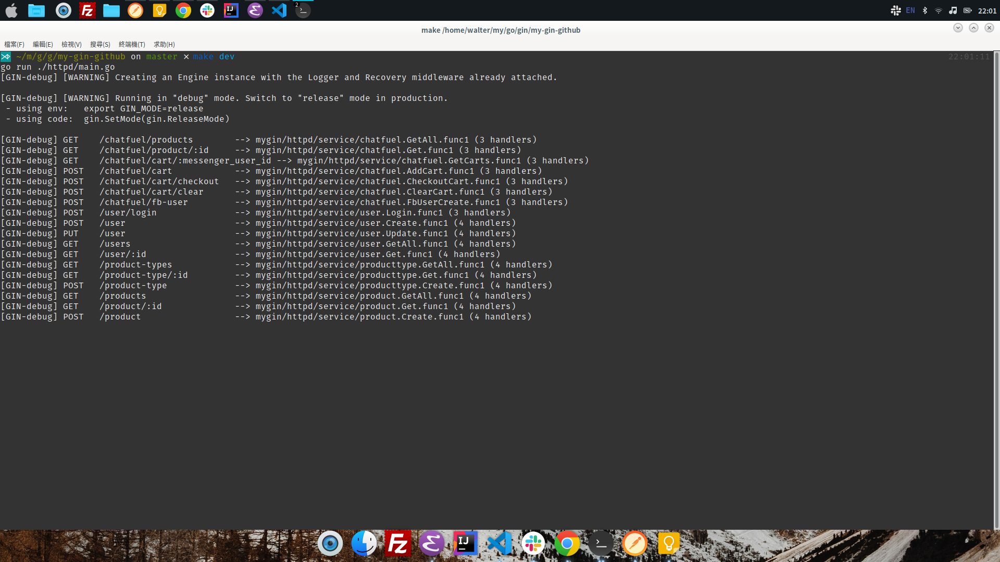

# my-gin-github 第一版

## Gin + Gorm + Mysql + JWT + Chatfuel

### 純後端 API(含 Chatfuel)
### 內含 mysql db: my_projcet.sql (記得改成本地端連線帳號密碼)
#### 測試帳號: test1/test1, test2/test2, test3/test3
### 支持 JWT (Json Web Token)(改進中)
### JWT 實作參考：https://www.bandari.net/blog/23

### 所有 API 接口

